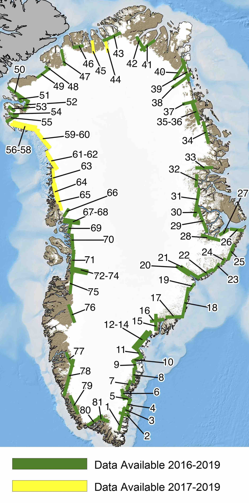

# resample_GLISTIN_DEMs
This set of codes is a Python toolbox to download and resample GLISTIN-A radar interferometer digital elevation models from NASA's Oceans Melting Greenland campaign. 

This code was authored by **Mr. Matthew Gonzalgo**, **Mr. Forrest Graham**, and **Dr. Mike Wood**. Matthew and Forrest were JPL summer interns and Mike Wood was a JPL postdoc. 

The official OMG GLISTIN-A data product is hosted on NASA's <a href="https://podaac.jpl.nasa.gov/">PO.DAAC</a>: 
<a href="https://podaac.jpl.nasa.gov/dataset/OMG_L3_ICE_ELEV_GLISTINA">OMG_L3_ICE_ELEV_GLISTINA</a>

<br>
<b>Swath Locations and Numbers</b>


<br>
<b>Example gridded swath after resampling</b>


<br><br>


## Getting Started
Required Python packages: ```numpy```,```scipy```, ```argparse```, ```requests```, ```pyresample```, ```utm```, ```netCDF4```, ```xarray```, ```osr```

From a fresh anaconda environment, it is recommended to use this installation sequence:
```
pip install requests
conda install -c conda-forge pyresample
pip install netCDF4
pip install xarray
conda install -c conda-forge gdal
pip install pyproj
pip install utm
pip install bs4
conda install -c conda-forge scipy
```

After the installing the required packages,
1. Determine a directory on your local machine where the Level 1 data and resampled output products will be stored. This directory is referred to as "dataFolder" in the scripts provided.
2. Determine the indicies of the GLISTIN-A DEMs to downloaded. Refer to the <a href="GLISTIN-A_DEM_Index_Domains.pdf">Swath Location Map</a> to see the indices of all swaths.

## Steps to Generate Resampled GLISTIN-A DEMs in NetCDF format

1. Download the Level-2 GLISTIN-A DEMs and associated metadata using **download_level_2_data.py**
2. (Optional) Download a geoid layer to reference the elevation measurements to mean sea level
3. Resample the Level-2 data using **resample_GLISTIN_DEMs.py** 

### Step 1: Download the Level-2 data GLISTIN-A DEMs and associated metadata using download_level_2_data.py

Use **download_level_2_data.py** to download level 2 data from the [UAVSAR website](https://uavsar.jpl.nasa.gov/).

Keywords:
- dataFolder (-d): (Required) Directory where resampled data will be stored on local machine.

- swathIndices (-i): (Optional) Set of swath indices to resample, separated by spaces.  Default is -1: resample all swaths.
 
- years (-y): (Optional) Set of years to download, separated by spaces. Default: -1 (download swaths in all years 2016-2019). 

Example command to download only years 2016 and 2017 for swath indices 1,2,3,4, and 52:
```
python download_level_2_data.py -d '/path/to/dataFolder' -y 2016 2017 -i 1 2 3 4 52
```


Example command to download all available years of data for swath index 52:
```
python download_level_2_data.py -d '/path/to/dataFolder' -i 52 
```

After downloading the above example (swath 52, all years), you will have a directory structure with files that should look like the following:
```
> cd /path/to/dataFolder
> find .
.
./Raw
./Raw/2017
./Raw/2017/Data
./Raw/2017/Data/greenl_17914_17037_011_170321_ALTTBB_HH_04.hgt.grd
./Raw/2017/Metadata
./Raw/2017/Metadata/greenl_17914_17037_011_170321_ALTTBB_HH_04_metadata.txt
./Raw/2019
./Raw/2019/Data
./Raw/2019/Data/greenl_17914_19022_009_190413_ALTTBB_HH_01.hgt.grd
./Raw/2019/Metadata
./Raw/2019/Metadata/greenl_17914_19022_009_190413_ALTTBB_HH_01_metadata.txt
./Raw/2018
./Raw/2018/Data
./Raw/2018/Data/greenl_17914_18014_005_180315_ALTTBB_HH_01.hgt.grd
./Raw/2018/Metadata
./Raw/2018/Metadata/greenl_17914_18014_005_180315_ALTTBB_HH_01_metadata.txt
./Raw/2016
./Raw/2016/Data
./Raw/2016/Data/greenl_17914_16037_013_160330_ALTTBB_HH_03.hgt.grd
./Raw/2016/Metadata
./Raw/2016/Metadata/greenl_17914_16037_013_160330_ALTTBB_HH_03_metadata.txt
```

### Step 2 (Optional): Download a geoid layer to reference the elevation measurements to mean sea level 

To include a geoid file with your resampling, you must include a directory called 'Geoid' within your specified dataFolder that contains your geoid file. Feel free to use any geoid that suits your purposes.  Here use the
<a href=https://link.springer.com/article/10.1007/s10712-016-9406-y>GOC05c geoid</a> of Fetcher et al. [2017].

To obtain the GOCO05c geoid and prepare it for use in resample_GLISTIN_DEMs, follow the following steps:
1. Go to http://icgem.gfz-potsdam.de/calcgrid
2. Under Model Selection, choose Longtime Model -> GOCO05c.
3. Under Functional Selection, choose geoid.
4. Under Geographic Selection, set longitude bounds to -75.9 to -9.8, latitude bounds to 55.2 to 86.8, and Grid Step to 0.1.
5. Leave all other parameters as their default valies, and 'start computation'.
6. When file is complete, click Download Grid and save to **dataFolder/Geoid**
7. Finally, convert this file to a netCDF file using the **geoid_grid_to_nc.py** function.

Example command to convert the geoid grid to a NetCDF file:
```
python geoid_grid_to_nc.py -d '/path/to/dataFolder' -g 'GOCO05c_383e72b1d9fbea44d4c550a7446ff8fcb6a57aba0bfdd6293a3e4b72f86030aa.gdf'
```

To use a different geoid, you will likely have to modify **geoid_grid_to_nc.py**.


### Step 3: Resample the Level-2 data using **resample_GLISTIN_DEMs.py**

To resample data, use **resample_GLISTIN_DEMs.py**

Keywords:
- dataFolder (-d): (Required) Directory where resampled data will be stored on local machine.

- resolution (-r): (Optional) Horizontal resolution in meters of the new grid used for the resampling. Default: 50 (meters).

- swathIndices (-i): (Optional) Set of swath indices to resample, separated by spaces.  Default is -1: resample all swaths.

- years (-y): (Optional) Set of years to resample, separated by spaces. Default: -1 (resample swaths in all years 2016-2019). 

- projection (-p): (Optional) The projection of the output DEM. Input with an EPSG reference code as EPSG:XXXX or 'UTM'.  Default: 'UTM', the UTM zone that corresponds to the center lat/long of the swath. This data spans UTM zones 19N to 27N.

- addGeoid (-g): (Optional) Choose 1 if you would like to add a geoid correction to the file, 0 otherwise. Default: 0, do not include a geoid file.  Geoid field must be downloaded manually prior to running this script using the instructions provided on github.com/NASA/glistin). 


Example command to resample all DEMs for all years at 50m resolution, exluding the optional geoid layer:
```
python resample_GLISTIN_DEMs.py -d '/path/to/dataFolder' 
```

Example command to resample the DEMs for swath indices 1 2 3 4 and 52 in years 2018 and 2019 at 500m resolution, including the geoid layer:
```
python resample_GLISTIN_DEMs.py -d '/path/to/dataFolder' -i 1 2 3 4 52 -y 2018 2019 -g 1 -r 500
```

#### Benchmarks
The time required to resample the GLISTIN-A DEM data is a function of both resolution and the size of the initial swath. The resample time will increase with the requested grid spacing and number of points in the initital swath.

For example, swath 16 is a relatively small swath and the following wall-clock times were required for the resample:
- 50 m: 79 seconds
- 100 m: 173 seconds
- 500 m: 3332 seconds

As another example, swath 1 is a relatively large swath and the following wall-clock times were required for the resample:
- 50 m: 162 seconds
- 100 m: 276 seconds
- 500 m: 3842 seconds
